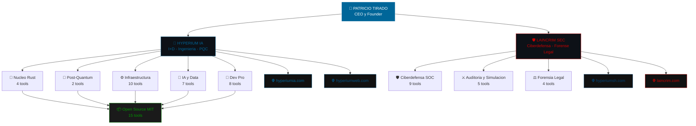

<!-- ═══════════════════════════════════════════════════════════════════════ -->
<!--                          HEADER ANIMADO                               -->
<!-- ═══════════════════════════════════════════════════════════════════════ -->

 

<!-- NAVEGACIÓN RÁPIDA -->
&nbsp;
&nbsp;
&nbsp;
&nbsp;

  

<!-- TYPING ANIMATION v3 -->

 

<!-- MÉTRICAS FLASH -->
<table>
<tr>
<td align="center"></td>
<td align="center"></td>
<td align="center"></td>
<td align="center"></td>
<td align="center"></td>
</tr>
</table>

 

---

<!-- ═══════════════════════════════════════════════════════════════════════ -->
<!--                      MAPA DEL ECOSISTEMA                              -->
<!-- ═══════════════════════════════════════════════════════════════════════ -->

## 🗺️ Mapa del Ecosistema — 64 Herramientas, 2 Empresas, 4 Plataformas

> **De 64 herramientas técnicas a una arquitectura visible y comprensible en 3 segundos.**

 

---

<!-- ═══════════════════════════════════════════════════════════════════════ -->
<!--                         MANIFIESTO                                     -->
<!-- ═══════════════════════════════════════════════════════════════════════ -->

## ⚡ Manifiesto de Ingeniería

> ### *"Mis repositorios son ecosistemas de código funcional y auditable, listos para producción. Cero Nube. Todo Ingeniería."*

 

Ingeniero de Software centrado en la creación de ecosistemas de código **robustos, escalables y testeados** que sirven como la base de la **ciberdefensa corporativa**.

Fusiono la **ingeniería de software de alto nivel** (con rigor de producción on-premise) con la **disciplina defensiva corporativa** y la **cadena de custodia legal**, asegurando que los sistemas que construyo no solo funcionen, sino que sean **resilientes y auditables judicialmente**.

 

---

<!-- ═══════════════════════════════════════════════════════════════════════ -->
<!--              LIDERAZGO EJECUTIVO y RED ESTRATÉGICA                     -->
<!-- ═══════════════════════════════════════════════════════════════════════ -->

## 🏛️ Liderazgo Ejecutivo y Red Estratégica

<table>
<tr>
<td colspan="3" align="center" style="padding:20px;">
<b style="font-size:22px;">👤 Patricio Tirado</b> 
CEO y Founder | Hyperium IA y LAINCRIM SEC  
San Antonio, Chile 🇨🇱 · Alcance Nacional → LATAM
</td>
</tr>
</table>

 

<table>
<tr>
<td width="33%" align="center" valign="top">
<b style="font-size:15px;">🏛️ Gobierno y Sector Público</b>  
Red directa con líderes gubernamentales, legisladores y funcionarios de alto nivel. Experiencia en marcos regulatorios gubernamentales (Ley 19.628, LFPDPPP).
</td>
<td width="33%" align="center" valign="top">
<b style="font-size:15px;">🏢 Corporativo y Enterprise</b>  
Conexiones C-level con grandes corporaciones chilenas y latinoamericanas. 14+ empresas confían en el ecosistema para su presencia digital y seguridad.
</td>
<td width="33%" align="center" valign="top">
<b style="font-size:15px;">⚖️ Legal y Judicial</b>  
Colaboración con estudios jurídicos y profesionales del sector legal. Herramientas de forensia con cadena de custodia judicial.
</td>
</tr>
</table>

 

<table>
<tr>
<td align="center"></td>
<td align="center"></td>
<td align="center"></td>
<td align="center"></td>
<td align="center"></td>
</tr>
</table>

 

---

<!-- ═══════════════════════════════════════════════════════════════════════ -->
<!--                    TOP 6 PRODUCTOS DESTACADOS                          -->
<!-- ═══════════════════════════════════════════════════════════════════════ -->

## 🏆 Top 6 Productos — Los Más Probados del Ecosistema

<table>
<tr>
<td width="33%" align="center" valign="top">
<b style="font-size:16px;">🔮 Q-Audit Pro</b>  
Motor de preparación criptográfica post-cuántica. CBOM, riesgo cuántico y migración NIST FIPS 203/204/205.  

</td>
<td width="33%" align="center" valign="top">
<b style="font-size:16px;">⚔️ BAS-Pro</b>  
Breach and Attack Simulation: valida tus defensas con ataques MITRE ATT y CK reales.  

</td>
<td width="33%" align="center" valign="top">
<b style="font-size:16px;">🔒 LOCK-STATE</b>  
Motor de Contención y Preservación de Tiempo Cero. Rust. Compliance ISO/NIST/PCI/GDPR.  

</td>
</tr>
<tr>
<td width="33%" align="center" valign="top">
<b style="font-size:16px;">💳 TAT-Pro</b>  
Transactional Audit and Triage: auditoría de seguridad para plataformas de pago.  

</td>
<td width="33%" align="center" valign="top">
<b style="font-size:16px;">🛡️ Vulnerability Mgmt</b>  
Gestión de hallazgos, Asset Inventory, Risk Scoring y CVSS v3.1 nativo.  

</td>
<td width="33%" align="center" valign="top">
<b style="font-size:16px;">🧠 Threat Intel Platform</b>  
TIP local: IOCs Scoring, STIX 2.1 y mapeo MITRE ATT y CK.  

</td>
</tr>
</table>

 

---

<!-- ═══════════════════════════════════════════════════════════════════════ -->
<!--                   MAESTRÍA EN CUMPLIMIENTO                             -->
<!-- ═══════════════════════════════════════════════════════════════════════ -->

## 📜 Maestría en Cumplimiento Normativo

> **15 frameworks implementados, auditados y certificables en herramientas de producción real.**

 

<table>
<tr>
<td align="center"></td>
<td align="center"></td>
<td align="center"></td>
<td align="center"></td>
<td align="center"></td>
</tr>
<tr>
<td align="center"></td>
<td align="center"></td>
<td align="center"></td>
<td align="center"></td>
<td align="center"></td>
</tr>
<tr>
<td align="center"></td>
<td align="center"></td>
<td align="center"></td>
<td align="center"></td>
<td align="center"></td>
</tr>
</table>

 

<table>
<tr>
<td width="50%" align="center">

**🛡️ Defensa y Respuesta**
NIST CSF · NIST SP 800-61 · MITRE ATT and CK

</td>
<td width="50%" align="center">

**🔐 Criptografía Post-Cuántica**
NIST FIPS 203/204/205 · PQC Migration

</td>
</tr>
<tr>
<td width="50%" align="center">

**📋 Compliance Corporativo**
ISO 27001/27002 · PCI-DSS · GDPR · OWASP

</td>
<td width="50%" align="center">

**🇨🇱 Regulación Chilena**
Ley 19.628 · LFPDPPP · Cadena de Custodia

</td>
</tr>
</table>

 

---

<!-- ═══════════════════════════════════════════════════════════════════════ -->
<!--                    ECOSISTEMA COMPLETO                                 -->
<!-- ═══════════════════════════════════════════════════════════════════════ -->

## 📦 Ecosistema Completo — 64 Herramientas de Producción

<b>🔮 Núcleo Rust de Alta Seguridad</b> (4 herramientas · Rust Core)

 

| Herramienta | Descripción Operativa |
|---|---|
| **[Hyperium Sentinel](https://github.com/hyperiumia/hyperium-sentinel)** | Motor de vigilancia y correlación de amenazas en tiempo real (Rust) |
| **[LOCK-STATE](https://github.com/hyperiumia/hyperium-lock-state-docs)** 🔒 | Motor de Contención y Preservación de Tiempo Cero · 123 tests · ISO/NIST/PCI/GDPR |
| **[Hyperium Red-Core](https://github.com/hyperiumia/hyperium-red-core)** | Núcleo de análisis y respuesta ofensiva controlada (Rust) |
| **[Hyperium Zero-State](https://github.com/hyperiumia/hyperium-zero-state)** | Motor de preservación y recuperación de estado ante crisis (Rust) |

<b>🛡️ Ciberdefensa Premium (SOC)</b> (9 herramientas · Security Operations)

 

| Herramienta | Descripción Operativa |
|---|---|
| **[OSINT Recon Pro](https://github.com/hyperiumia/osint-recon)** | Mapeo de superficie de ataque y reconocimiento externo |
| **[Hardening Pro](https://github.com/hyperiumia/hardening)** | Auditoría profunda y endurecimiento de seguridad Linux |
| **[Python Sentinel Pro](https://github.com/hyperiumia/python-sentinel)** | Motor SIEM local para correlación de ataques y reporte forense |
| **[Threat Intelligence Platform](https://github.com/hyperiumia/threat-intelligence)** | TIP local: IOCs Scoring, STIX 2.1 y mapeo MITRE ATT y CK · 110 tests |
| **[Vulnerability Mgmt Platform](https://github.com/hyperiumia/vulnerability-mgmt)** | Gestión de hallazgos, Asset Inventory, Risk Scoring y CVSS v3.1 nativo · 114 tests |
| **[Hyperium API Shield](https://github.com/hyperiumia/hyperium-api-shield)** | Escudo de protección avanzada para APIs y superficie de ataque |
| **Hyperium OT-Shield** | Protección de infraestructura OT/SCADA y sistemas industriales |
| **Hyperium Aegis** | Escudo defensivo multicapa para entornos corporativos (TypeScript) |
| **[Hyperium Sovereign OS](https://github.com/hyperiumia/hyperium-sovereign-os)** | Endurecimiento de SO a nivel soberano con políticas de seguridad nativas |

<b>⚔️ Auditoría y Simulación de Ataques</b> (5 herramientas · Red Team Validation)

 

| Herramienta | Descripción Operativa |
|---|---|
| **[BAS-Pro](https://github.com/hyperiumia/bas-pro)** | Breach and Attack Simulation: valida tus defensas con ataques MITRE ATT y CK reales · 140 tests |
| **[TAT-Pro](https://github.com/hyperiumia/tat-pro)** | Transactional Audit and Triage: auditoría de seguridad para plataformas de pago · 120 tests |
| **CyberAudit** | Plataforma de auditoría de ecosistemas seguros — Hyperium IA |
| **Smart Audit** | Motor de auditoría inteligente automatizada con análisis de riesgo |
| **[Code Audit](https://github.com/hyperiumia/hyperium-code-audit)** | Auditoría profunda de código fuente, dependencias y superficie de ataque |

<b>🔐 Post-Quantum y Criptografía</b> (2 herramientas · Quantum-Safe)

 

| Herramienta | Descripción Operativa |
|---|---|
| **[Q-Audit Pro](https://github.com/hyperiumia/q-audit-pro)** | Motor de preparación criptográfica post-cuántica. CBOM, riesgo cuántico y migración NIST FIPS 203/204/205 · 150 tests |
| **[TLS-Pro](https://github.com/hyperiumia/tls-pro)** | Evaluación profunda TLS/SSL con análisis de certificados y vulnerabilidad cuántica (Rust) |

<b>⚙️ Infraestructura y DevSecOps</b> (10 herramientas · Core Platform)

 

| Herramienta | Descripción Operativa |
|---|---|
| **[FastAPI Boilerplate Pro](https://github.com/hyperiumia/hyperium-fastapi-boilerplate)** | Base backend profesional en Python lista para producción (MIT) |
| **[API Gateway Pro](https://github.com/hyperiumia/api-gateway)** | Control de tráfico, autenticación y rate limiting centralizado |
| **[Container Orchestrator](https://github.com/hyperiumia/orchestrator)** | Despliegue y simulación local de orquestación de contenedores |
| **[CI/CD Pipeline Engine](https://github.com/hyperiumia/cicd-pipeline)** | Motor de automatización para pipelines build-test-deploy |
| **[Monitoring System](https://github.com/hyperiumia/monitoring-system)** | Observabilidad y alertas en tiempo real de infraestructura local |
| **Rate Limiter Pro** | Control de tasa de peticiones con algoritmos adaptativos |
| **Dependency Resolver Pro** | Resolución automática de dependencias y conflictos |
| **Config Manager Pro** | Gestión centralizada de configuraciones multi-entorno |
| **File Sync Pro** | Sincronización de archivos con detección de conflictos |
| **Task Queue Pro** | Cola de tareas asíncronas con reintentos y priorización |

<b>🤖 IA y Data Engineering</b> (7 herramientas · AI/ML Toolkit)

 

| Herramienta | Descripción Operativa |
|---|---|
| **RAG Pro** | Retrieval-Augmented Generation: motor de búsqueda semántica con IA |
| **Vector DB Pro** | Base de datos vectorial local para embeddings y búsqueda semántica |
| **Chatbot Engine Pro** | Motor de chatbot con procesamiento de lenguaje natural |
| **Text Summarizer Pro** | Resumen automático de documentos y textos largos |
| **Image Classifier Pro** | Clasificación de imágenes con modelos de visión por computadora |
| **Sentiment Analyzer Pro** | Análisis de sentimiento en textos y redes sociales |
| **Price Predictor Pro** | Modelo predictivo de precios con machine learning |

<b>🔧 Herramientas Dev Pro</b> (8 herramientas · Developer Toolkit)

 

| Herramienta | Descripción Operativa |
|---|---|
| **Database ORM Pro** | ORM profesional para Python con migraciones y relaciones |
| **Log Analyzer Pro** | Análisis profundo de logs con patrones y detección de anomalías |
| **Crawler Scraper Pro** | Web crawling y extracción de datos con respeto a robots.txt |
| **JSON Parser Pro** | Parser JSON avanzado con validación y transformaciones |
| **Regex Tester Pro** | Probador de expresiones regulares con visualización en tiempo real |
| **Task Scheduler Pro** | Planificador de tareas con cron y ejecución periódica |
| **URL Shortener Pro** | Acortador de URLs con analytics y expiración |
| **Hyperium Rank** | Motor de ranking y scoring para ecosistemas digitales |

<b>⚖️ Forensia Legal y Cadena de Custodia</b> (4 herramientas · Legal-Grade)

 

| Herramienta | Descripción Operativa |
|---|---|
| **[Forensic Collector Pro](https://github.com/hyperiumia/forensic-collector)** | Evidencia digital con cadena de custodia legal y sellado SHA-256 · 103 tests |
| **[Compliance Auditor Pro](https://github.com/hyperiumia/compliance-auditor)** | Auditoría basada en evidencia: ISO 27001, NIST, GDPR, LFPDPPP, Ley 19.628 · 99 tests |
| **[Incident Response Engine](https://github.com/hyperiumia/incident-response)** | NIST SP 800-61: Orquestación táctica Paso a Paso · 96 tests |
| **Encryption Toolkit Pro** | Suite de criptografía para sellado, protección y verificación de evidencia digital |

<b>📦 Open Source y Comunidad</b> (15 herramientas · MIT License)

 

| Herramienta | Descripción Operativa | License |
|---|---|:-:|
| **[Password Generator](https://github.com/hyperiumia/password-generator)** | Generador criptográficamente seguro con análisis de entropía | MIT |
| **[QR Generator](https://github.com/hyperiumia/qr-generator)** | Generador de códigos QR con personalización | MIT |
| **[File Organizer](https://github.com/hyperiumia/file-organizer)** | Organizador automático de archivos por tipo y fecha | MIT |
| **[Currency Converter](https://github.com/hyperiumia/currency-converter)** | Conversor de divisas en tiempo real | MIT |
| **[Pomodoro Timer](https://github.com/hyperiumia/pomodoro-timer)** | Temporizador Pomodoro para productividad | MIT |
| **[Calculator Pro](https://github.com/hyperiumia/calculator-pro)** | Calculadora con funciones avanzadas | MIT |
| **[News Scraper](https://github.com/hyperiumia/news-scraper)** | Scraper de noticias con RSS | MIT |
| **[Telegram Bot](https://github.com/hyperiumia/telegram-bot)** | Bot de Telegram con handlers y comandos | MIT |
| **[Data Dashboard](https://github.com/hyperiumia/data-dashboard)** | Dashboard de datos con visualización | MIT |
| **FastAPI REST** | API REST con FastAPI y documentación automática | MIT |
| **Task CLI** | Gestor de tareas desde terminal | MIT |
| **Security Scanner** | Escáner de vulnerabilidades básico para proyectos | MIT |
| **Password Analyzer** | Analizador de fortaleza de contraseñas | MIT |
| **Regex Tester** | Probador de expresiones regulares | MIT |
| **Markdown Previewer** | Editor y visor de Markdown | MIT |

 

---

<!-- ═══════════════════════════════════════════════════════════════════════ -->
<!--                     UNIVERSO DIGITAL                                   -->
<!-- ═══════════════════════════════════════════════════════════════════════ -->

## 🌐 Universo Digital Hyperium

<table>
<tr>
<td width="25%" align="center">
<b style="font-size:14px;">🔬 Hyperium IA</b> 
R and D · Ingeniería · PQC  

</td>
<td width="25%" align="center">
<b style="font-size:14px;">💻 Hyperium Web</b> 
Desarrollo · Web · SaaS  

</td>
<td width="25%" align="center">
<b style="font-size:14px;">🖥️ Hyperium SH</b> 
Shell · Sistemas · CLI  

</td>
<td width="25%" align="center">
<b style="font-size:14px;">🛡️ LAINCRIM SEC</b> 
Ciberdefensa · Forense Legal  

</td>
</tr>
</table>

 

---

<!-- ═══════════════════════════════════════════════════════════════════════ -->
<!--                    INDUSTRIAS y SECTORES                               -->
<!-- ═══════════════════════════════════════════════════════════════════════ -->

## 🌍 Industrias y Sectores — Alcance Empresarial

> **10 sectores. 14 empresas. Un ecosistema que protege a Chile de punta a punta.**

 

<table>
<tr>
<td align="center"></td>
<td align="center"></td>
<td align="center"></td>
<td align="center"></td>
<td align="center"></td>
</tr>
<tr>
<td align="center"></td>
<td align="center"></td>
<td align="center"></td>
<td align="center"></td>
<td align="center"></td>
</tr>
</table>

 

| Sector | Cliente / Proyecto | Solución |
|---|---|---|
| 🏛️ Gobierno y Público | Ciudadano Seguro · MTC Organización | Seguridad ciudadana · Consultoría |
| ⚖️ Legal y Judicial | Estudio Jurídico Rivera y Montoya | Presencia digital · Forense |
| 🥊 Deportes y Wellness | WKB Chile · Elite Thai Box Chile | E-commerce · Marketing |
| 🥗 Salud y Nutrición | Macarena Nutrición | Sitio web profesional |
| 🌅 Educación y Coaching | Mentor 5AM | Plataforma de liderazgo |
| ✨ Hospitality | Club Aura VIP | Landing premium |
| 🎵 Cultura y Música | Canto Libre Oficial | Presencia digital |
| ✝️ Comunidad | La Armadura de Dios | Plataforma comunitaria |
| 🔬 Tech y R and D | Hyperium IA · Hyperium Web · Hyperium SH · LAINCRIM SEC | 4 plataformas propias |

 

---

<!-- ═══════════════════════════════════════════════════════════════════════ -->
<!--                      BUSINESS UNITS                                    -->
<!-- ═══════════════════════════════════════════════════════════════════════ -->

## 🏢 Estructura Business

| | Empresa | Enfoque Estratégico | Presencia |
|:-:|---|---|:-:|
| 🔬 | **[Hyperium IA](https://hyperiumia.com)** | I+D en Ingeniería robusta, Arquitectura de Sistemas y Post-Quantum Cryptography | 🌐 |
| 🛡️ | **[LAINCRIM SEC](https://laincrim.com)** | Ciberseguridad Defensiva e Investigación Forense Digital Legal | 🌐 |

 

---

<!-- ═══════════════════════════════════════════════════════════════════════ -->
<!--                       ARSENAL TÉCNICO                                  -->
<!-- ═══════════════════════════════════════════════════════════════════════ -->

## ⚙️ Arsenal Técnico

 

| Categoría | Stack |
|---|---|
| **Backend y Core** | Python · Rust · FastAPI · Bash · TypeScript · SQL · Clean Code |
| **Infraestructura** | Docker · Linux · Nginx · PostgreSQL · On-Premise Architecture |
| **Seguridad y Forense** | Blue Team · Digital Forensics · MITRE ATT and CK · STIX 2.1 · OWASP · Post-Quantum |
| **Calidad y Resiliencia** | TDD (2,508+ tests) · CI/CD · Zero Cloud · 100% Auditado |

 

---

<!-- ═══════════════════════════════════════════════════════════════════════ -->
<!--                       PRINCIPIOS                                       -->
<!-- ═══════════════════════════════════════════════════════════════════════ -->

## 🧱 Principios de Ingeniería

<table>
<tr>
<td width="50%" align="center">

**🧪 Test-Driven Development**
Cada línea de código respaldada por tests automatizados

</td>
<td width="50%" align="center">

**🔒 Zero Cloud / 100% On-Premise**
Control total sobre la infraestructura y los datos

</td>
</tr>
<tr>
<td width="50%" align="center">

**⚖️ Legal-Grade Forensics**
Cadena de custodia legal, sellado SHA-256, auditabilidad judicial

</td>
<td width="50%" align="center">

**🏗️ Resilient Architecture**
Sistemas diseñados para resistir, recuperarse y escalar

</td>
</tr>
</table>

 

---

<!-- ═══════════════════════════════════════════════════════════════════════ -->
<!--                       VISIÓN EJECUTIVA                                 -->
<!-- ═══════════════════════════════════════════════════════════════════════ -->

## 🎯 Visión Ejecutiva

> ### *"La ciberseguridad no es un producto — es un ecosistema. Y los ecosistemas se construyen con ingeniería, regulación y relaciones de confianza."*

 

<table>
<tr>
<td width="33%" align="center" valign="top">
<b style="font-size:15px;">🔬 Hyperium IA — La Ingeniería</b>  
I+D, arquitectura de sistemas, post-quantum cryptography, Rust y Python de nivel producción. La base técnica que lo hace todo posible.
</td>
<td width="33%" align="center" valign="top">
<b style="font-size:15px;">🛡️ LAINCRIM SEC — La Defensa</b>  
Ciberdefensa corporativa, forensia legal con cadena de custodia, compliance regulatorio. La armadura que protege a empresas y gobierno.
</td>
<td width="33%" align="center" valign="top">
<b style="font-size:15px;">🌐 Hyperium Web y SH — La Presencia</b>  
Desarrollo web, SaaS, herramientas CLI. La cara digital que 14+ empresas presentan al mundo.
</td>
</tr>
</table>

 

<table>
<tr>
<td align="center">

**🗺️ 2025 → LATAM Expansion**
Del alcance nacional al regional con un ecosistema probado

</td>
<td align="center">

**🔮 2025 → Post-Quantum Ready**
Preparando a Chile para la era cuántica con herramientas NIST FIPS

</td>
</tr>
</table>

 

---

<!-- ═══════════════════════════════════════════════════════════════════════ -->
<!--                    DASHBOARD OPERATIVO                                 -->
<!-- ═══════════════════════════════════════════════════════════════════════ -->

## 📊 Dashboard Operativo — Números que Importan

<table>
<tr>
<td align="center"></td>
<td align="center"></td>
<td align="center"></td>
</tr>
<tr>
<td align="center"></td>
<td align="center"></td>
<td align="center"></td>
</tr>
<tr>
<td align="center"></td>
<td align="center"></td>
<td align="center"></td>
</tr>
</table>

 

<table>
<tr>
<td align="center"></td>
<td align="center"></td>
<td align="center"></td>
</tr>
</table>

 

---

<!-- ═══════════════════════════════════════════════════════════════════════ -->
<!--                    MÉTRICAS DE GITHUB                                   -->
<!-- ═══════════════════════════════════════════════════════════════════════ -->

## 📊 Métricas de GitHub

<table>
<tr>
<td align="center">

</td>
<td align="center">

</td>
</tr>
</table>

 

  

  

---

<!-- ═══════════════════════════════════════════════════════════════════════ -->
<!--                         CTA EJECUTIVO                                   -->
<!-- ═══════════════════════════════════════════════════════════════════════ -->

### 💬 ¿Hablemos de Nivel Ejecutivo?

 

<table>
<tr>
<td width="33%" align="center">

**🏛️ Gobierno / Sector Público**
¿Necesitas compliance, ciberseguridad o forensia legal para tu entidad?

</td>
<td width="33%" align="center">

**🏢 Corporativo / Enterprise**
¿Tu empresa necesita auditoría, hardening o un SOC local de alto nivel?

</td>
<td width="33%" align="center">

**🔬 Desarrolladores / CISOs**
¿Buscas código funcional, testado y listo para producción on-premise?

</td>
</tr>
</table>

 

&nbsp;

&nbsp;

 

> *"No vendo software. Construyo ecosistemas de defensa que gobiernos y empresas usan para proteger lo que importa."*
> **— Patricio Tirado, CEO y Founder**

 

---

<!-- ═══════════════════════════════════════════════════════════════════════ -->
<!--                        FOOTER ANIMADO                                  -->
<!-- ═══════════════════════════════════════════════════════════════════════ -->

