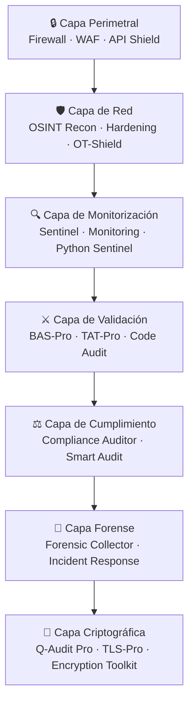
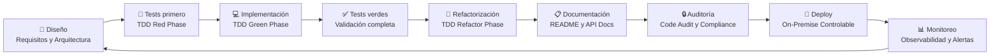
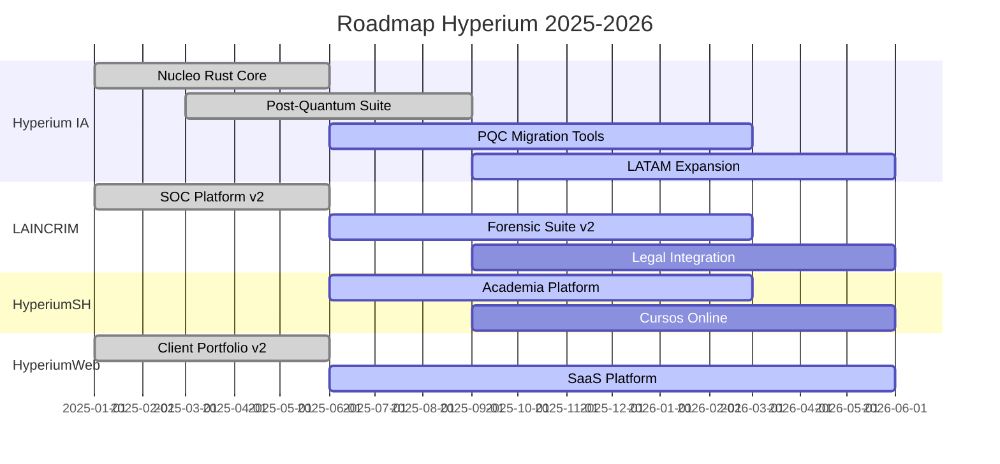

 

&nbsp;
&nbsp;
&nbsp;
&nbsp;

  

 

<table>
<tr>
<td align="center"></td>
<td align="center"></td>
<td align="center"></td>
<td align="center"></td>
<td align="center"></td>
</tr>
</table>

 

---

## 🗺️ Mapa del Ecosistema — 60+ Herramientas, 2 Marcas Principales, 4 Plataformas

> **De más de 60 herramientas técnicas a una arquitectura visible y comprensible en 3 segundos.**

 

---

## ⚡ Manifiesto de Ingeniería

> ### *"Mis repositorios son ecosistemas de código funcional y auditable, listos para producción. Arquitectura diseñada para despliegue on-premise. Todo Ingeniería."*

 

Ingeniero de Software centrado en la creación de ecosistemas de código **robustos, escalables y testeados** que sirven como la base de la **ciberdefensa corporativa**.

Fusiono la **ingeniería de software de alto nivel** (con rigor de producción on-premise) con la **disciplina defensiva corporativa** y la **metodología de cadena de custodia**, asegurando que los sistemas que construyo no solo funcionen, sino que sean **resilientes y auditables**.

 

---

## 🏛️ Liderazgo Ejecutivo y Red Estratégica

<table>
<tr>
<td colspan="3" align="center" style="padding:20px;">
<b style="font-size:22px;">👤 Patricio Tirado</b> 
CEO y Founder | Hyperium IA y LAINCRIM  
San Antonio, Chile 🇨🇱 · Alcance Nacional → LATAM
</td>
</tr>
</table>

 

<table>
<tr>
<td width="33%" align="center" valign="top">
<b style="font-size:15px;">🏛️ Gobierno y Sector Público</b>  
Red directa con líderes gubernamentales, legisladores y funcionarios de alto nivel. Experiencia en marcos regulatorios gubernamentales (Ley 19.628, LFPDPPP).
</td>
<td width="33%" align="center" valign="top">
<b style="font-size:15px;">🏢 Corporativo y Enterprise</b>  
Conexiones C-level con grandes corporaciones chilenas y latinoamericanas. Más de 14 clientes y proyectos atendidos con el ecosistema.
</td>
<td width="33%" align="center" valign="top">
<b style="font-size:15px;">⚖️ Legal y Judicial</b>  
Colaboración con estudios jurídicos y profesionales del sector legal. Herramientas de forensia con metodología de cadena de custodia.
</td>
</tr>
</table>

 

<table>
<tr>
<td align="center"></td>
<td align="center"></td>
<td align="center"></td>
<td align="center"></td>
<td align="center"></td>
</tr>
</table>

 

---

## 🏆 Top 6 Productos — Los Más Probados del Ecosistema

<table>
<tr>
<td width="33%" align="center" valign="top">
<b style="font-size:16px;">🔮 Q-Audit Pro</b>  
Motor de preparación criptográfica post-cuántica. CBOM, riesgo cuántico y migración NIST FIPS 203/204/205.  

</td>
<td width="33%" align="center" valign="top">
<b style="font-size:16px;">⚔️ BAS-Pro</b>  
Breach and Attack Simulation: valida tus defensas con ataques MITRE ATT y CK reales.  

</td>
<td width="33%" align="center" valign="top">
<b style="font-size:16px;">🔒 LOCK-STATE</b>  
Motor de Contención y Preservación de Tiempo Cero. Rust. Compliance ISO/NIST/PCI/GDPR.  

</td>
</tr>
<tr>
<td width="33%" align="center" valign="top">
<b style="font-size:16px;">💳 TAT-Pro</b>  
Transactional Audit and Triage: auditoría de seguridad para plataformas de pago.  

</td>
<td width="33%" align="center" valign="top">
<b style="font-size:16px;">🛡️ Vulnerability Mgmt</b>  
Gestión de hallazgos, Asset Inventory, Risk Scoring y CVSS v3.1 nativo.  

</td>
<td width="33%" align="center" valign="top">
<b style="font-size:16px;">🧠 Threat Intel Platform</b>  
TIP local: IOCs Scoring, STIX 2.1 y mapeo MITRE ATT y CK.  

</td>
</tr>
</table>

 

---

## 📜 Maestría en Cumplimiento Normativo

> **15 frameworks implementados, auditados y certificables en herramientas de producción real.**

 

<table>
<tr>
<td align="center"></td>
<td align="center"></td>
<td align="center"></td>
<td align="center"></td>
<td align="center"></td>
</tr>
<tr>
<td align="center"></td>
<td align="center"></td>
<td align="center"></td>
<td align="center"></td>
<td align="center"></td>
</tr>
<tr>
<td align="center"></td>
<td align="center"></td>
<td align="center"></td>
<td align="center"></td>
<td align="center"></td>
</tr>
</table>

 

<table>
<tr>
<td width="50%" align="center">
<b>🛡️ Defensa y Respuesta</b> 
NIST CSF · NIST SP 800-61 · MITRE ATT y CK
</td>
<td width="50%" align="center">
<b>🔐 Criptografía Post-Cuántica</b> 
NIST FIPS 203/204/205 · PQC Migration
</td>
</tr>
<tr>
<td width="50%" align="center">
<b>📋 Compliance Corporativo</b> 
ISO 27001/27002 · PCI-DSS · GDPR · OWASP
</td>
<td width="50%" align="center">
<b>🇨🇱 Regulación Chilena</b> 
Ley 19.628 · LFPDPPP · Cadena de Custodia
</td>
</tr>
</table>

 

---

## 📋 Matriz de Cumplimiento por Herramienta

| Herramienta | ISO 27001 | NIST CSF | GDPR | PCI-DSS | Ley 19.628 | PQC |
|---|:-:|:-:|:-:|:-:|:-:|:-:|
| Q-Audit Pro | ✅ | ✅ | ✅ | — | — | ✅ |
| BAS-Pro | ✅ | ✅ | — | — | — | — |
| LOCK-STATE | ✅ | ✅ | ✅ | ✅ | ✅ | — |
| TAT-Pro | ✅ | ✅ | ✅ | ✅ | — | — |
| Vulnerability Mgmt | ✅ | ✅ | — | — | — | — |
| Threat Intel Platform | ✅ | ✅ | — | — | — | — |
| Forensic Collector | ✅ | ✅ | ✅ | — | ✅ | — |
| Compliance Auditor | ✅ | ✅ | ✅ | ✅ | ✅ | — |
| Incident Response | ✅ | ✅ | — | — | ✅ | — |
| TLS-Pro | ✅ | — | — | ✅ | — | ✅ |
| Hardening Pro | ✅ | ✅ | — | — | — | — |
| Code Audit | ✅ | ✅ | — | — | — | — |

 

---

## 📦 Ecosistema Completo — Más de 60 Herramientas de Producción

<b>🔮 Núcleo Rust de Alta Seguridad</b> (4 herramientas · Rust Core)

 

**Motores escritos en Rust para máximo rendimiento, seguridad de memoria y confiabilidad en operaciones críticas.**

| # | Herramienta | Descripción Operativa | Tests |
|:-:|---|---|:-:|
| 1 | **[Hyperium Sentinel](https://github.com/hyperiumia/hyperium-sentinel)** | Motor de vigilancia y correlación de amenazas en tiempo real (Rust) | — |
| 2 | **[LOCK-STATE](https://github.com/hyperiumia/hyperium-lock-state-docs)** 🔒 | Motor de Contención y Preservación de Tiempo Cero · ISO/NIST/PCI/GDPR | 123 |
| 3 | **[Hyperium Red-Core](https://github.com/hyperiumia/hyperium-red-core)** | Núcleo de análisis y respuesta ofensiva controlada (Rust) | — |
| 4 | **[Hyperium Zero-State](https://github.com/hyperiumia/hyperium-zero-state)** | Motor de preservación y recuperación de estado ante crisis (Rust) | — |

📐 Detalle de LOCK-STATE

**Función principal:** Contención y preservación de evidencia digital con tiempo cero entre detección y sellado.

**Características principales:**
- Contención automática de evidencia digital
- Preservación de estado con sellado criptográfico inmediato
- Compliance ISO 27001, NIST CSF, PCI-DSS, GDPR
- Motor escrito en Rust para seguridad de memoria garantizada
- Cadena de custodia automatizada con timestamps

**Stack técnico:** Rust · SHA-256 · JSON Schema · TOML Config
**Tests:** 123 automatizados (TDD)
**Licencia:** Propietaria (documentación pública)

<b>🛡️ Ciberdefensa (SOC)</b> (9 herramientas · Security Operations)

 

**Suite completa de operaciones de seguridad: reconocimiento, endurecimiento, monitorización, inteligencia y respuesta.**

| # | Herramienta | Descripción Operativa | Tests |
|:-:|---|---|:-:|
| 5 | **[OSINT Recon Pro](https://github.com/hyperiumia/osint-recon)** | Mapeo de superficie de ataque y reconocimiento externo | — |
| 6 | **[Hardening Pro](https://github.com/hyperiumia/hardening)** | Auditoría profunda y endurecimiento de seguridad Linux | — |
| 7 | **[Python Sentinel Pro](https://github.com/hyperiumia/python-sentinel)** | Motor SIEM local para correlación de ataques y reporte forense | — |
| 8 | **[Threat Intelligence Platform](https://github.com/hyperiumia/threat-intelligence)** | TIP local: IOCs Scoring, STIX 2.1 y mapeo MITRE ATT y CK | 110 |
| 9 | **[Vulnerability Mgmt Platform](https://github.com/hyperiumia/vulnerability-mgmt)** | Gestión de hallazgos, Asset Inventory, Risk Scoring y CVSS v3.1 nativo | 114 |
| 10 | **[Hyperium API Shield](https://github.com/hyperiumia/hyperium-api-shield)** | Escudo de protección avanzada para APIs y superficie de ataque | — |
| 11 | **Hyperium OT-Shield** | Protección de infraestructura OT/SCADA y sistemas industriales | — |
| 12 | **Hyperium Aegis** | Escudo defensivo multicapa para entornos corporativos (TypeScript) | — |
| 13 | **[Hyperium Sovereign OS](https://github.com/hyperiumia/hyperium-sovereign-os)** | Endurecimiento de SO a nivel soberano con políticas de seguridad nativas | — |

📐 Detalle de Threat Intelligence Platform

**Función principal:** Plataforma local de inteligencia de amenazas para recolección, scoring y correlación de IOCs.

**Características principales:**
- Scoring automático de Indicators of Compromise (IOCs)
- Formato STIX 2.1 para interoperabilidad con otros TIPs
- Mapeo nativo a MITRE ATT y CK (técnicas y tácticas)
- Búsqueda y correlación en tiempo real
- Exportación de reportes forenses

**Stack técnico:** Python · STIX 2.1 · SQLite · FastAPI · Pytest
**Tests:** 110 automatizados (TDD)
**Standards:** MITRE ATT y CK · STIX 2.1 · TAXII

📐 Detalle de Vulnerability Mgmt Platform

**Función principal:** Gestión integral de vulnerabilidades con inventario de activos y scoring de riesgo CVSS v3.1.

**Características principales:**
- Asset Inventory completo con descubrimiento automático
- Risk Scoring nativo con CVSS v3.1 (Base, Temporal, Environmental)
- Workflow de gestión de hallazgos (Detect → Triage → Remediate → Verify)
- Integración con Compliance Auditor para mapeo regulatorio
- Dashboards de riesgo por activo, tipo y severidad

**Stack técnico:** Python · CVSS 3.1 · SQLAlchemy · FastAPI · Pytest
**Tests:** 114 automatizados (TDD)
**Standards:** CVSS v3.1 · CVE · CPE

<b>⚔️ Auditoría y Simulación de Ataques</b> (5 herramientas · Red Team Validation)

 

**Validación proactiva de defensas mediante simulación de ataques reales y auditoría automatizada.**

| # | Herramienta | Descripción Operativa | Tests |
|:-:|---|---|:-:|
| 14 | **[BAS-Pro](https://github.com/hyperiumia/bas-pro)** | Breach and Attack Simulation: valida tus defensas con ataques MITRE ATT y CK reales | 140 |
| 15 | **[TAT-Pro](https://github.com/hyperiumia/tat-pro)** | Transactional Audit and Triage: auditoría de seguridad para plataformas de pago | 120 |
| 16 | **CyberAudit** | Plataforma de auditoría de ecosistemas seguros — Hyperium IA | — |
| 17 | **Smart Audit** | Motor de auditoría inteligente automatizada con análisis de riesgo | — |
| 18 | **[Code Audit](https://github.com/hyperiumia/hyperium-code-audit)** | Auditoría profunda de código fuente, dependencias y superficie de ataque | — |

📐 Detalle de BAS-Pro

**Función principal:** Simulación automatizada de brechas y ataques para validar defensas contra vectores reales.

**Características principales:**
- Simulación de 200+ técnicas MITRE ATT y CK (Tactics, Techniques, Procedures)
- Validación automatizada de controles de seguridad
- Scoring de efectividad defensiva por capa
- Reporting con evidencia forense de cada simulación
- Integración con Vulnerability Mgmt para priorización

**Stack técnico:** Python · MITRE ATT and CK · Pytest · YAML Scenarios
**Tests:** 140 automatizados (TDD)
**Standards:** MITRE ATT and CK · OWASP Testing Guide

📐 Detalle de TAT-Pro

**Función principal:** Auditoría de seguridad específica para plataformas de pago y transacciones financieras.

**Características principales:**
- Análisis de flujos transaccionales financieros
- Detección de anomalías en transacciones de pago
- Triage automatizado de hallazgos por criticidad
- Compliance PCI-DSS nativo
- Reportes ejecutivos para auditorías financieras

**Stack técnico:** Python · PCI-DSS · SQLAlchemy · FastAPI · Pytest
**Tests:** 120 automatizados (TDD)
**Standards:** PCI-DSS · ISO 27001

<b>🔐 Post-Quantum y Criptografía</b> (3 herramientas · Quantum-Safe)

 

**Preparación para la era cuántica: migración criptográfica, evaluación de certificados y herramientas de cifrado.**

| # | Herramienta | Descripción Operativa | Tests |
|:-:|---|---|:-:|
| 19 | **[Q-Audit Pro](https://github.com/hyperiumia/q-audit-pro)** | Motor de preparación criptográfica post-cuántica. CBOM, riesgo cuántico y migración NIST FIPS 203/204/205 | 150 |
| 20 | **[TLS-Pro](https://github.com/hyperiumia/tls-pro)** | Evaluación profunda TLS/SSL con análisis de certificados y vulnerabilidad cuántica (Rust) | — |
| 21 | **Encryption Toolkit Pro** | Suite completa de herramientas criptográficas y gestión de claves | — |

📐 Detalle de Q-Audit Pro

**Función principal:** Motor completo de preparación para criptografía post-cuántica con análisis CBOM y ruta de migración.

**Características principales:**
- Cryptographic Bill of Materials (CBOM) automatizado
- Análisis de exposición a amenazas cuánticas (Store Now, Decrypt Later)
- Ruta de migración a NIST FIPS 203 (ML-KEM), 204 (ML-DSA), 205 (SLH-DSA)
- Risk scoring cuántico por dependencia criptográfica
- Dashboard ejecutivo de preparación post-cuántica
- Reportes de cumplimiento para auditorías regulatorias

**Stack técnico:** Python · NIST FIPS 203/204/205 · CBOM · FastAPI · Pytest
**Tests:** 150 automatizados (TDD) — El más testeado del ecosistema
**Standards:** NIST FIPS 203 · NIST FIPS 204 · NIST FIPS 205 · ETSI

<b>⚙️ Infraestructura y DevSecOps</b> (10 herramientas · Core Platform)

 

**Plataforma base de infraestructura: API management, orquestación, CI/CD, monitorización y utilidades operativas.**

| # | Herramienta | Descripción Operativa | Tests |
|:-:|---|---|:-:|
| 22 | **[FastAPI Boilerplate Pro](https://github.com/hyperiumia/hyperium-fastapi-boilerplate)** | Base backend profesional en Python lista para producción (MIT) | 18 |
| 23 | **[API Gateway Pro](https://github.com/hyperiumia/api-gateway)** | Control de tráfico, autenticación y rate limiting centralizado | 15 |
| 24 | **[Container Orchestrator](https://github.com/hyperiumia/orchestrator)** | Despliegue y simulación local de orquestación de contenedores | 12 |
| 25 | **[CI/CD Pipeline Engine](https://github.com/hyperiumia/cicd-pipeline)** | Motor de automatización para pipelines build-test-deploy | 14 |
| 26 | **[Monitoring System](https://github.com/hyperiumia/monitoring-system)** | Observabilidad y alertas en tiempo real de infraestructura local | 16 |
| 27 | **Rate Limiter Pro** | Control de tasa de peticiones con algoritmos adaptativos | — |
| 28 | **Dependency Resolver Pro** | Resolución automática de dependencias y conflictos | — |
| 29 | **Config Manager Pro** | Gestión centralizada de configuraciones multi-entorno | — |
| 30 | **File Sync Pro** | Sincronización de archivos con detección de conflictos | — |
| 31 | **Task Queue Pro** | Cola de tareas asíncronas con reintentos y priorización | — |

📐 Detalle de FastAPI Boilerplate Pro

**Función principal:** Plantilla base profesional para desarrollo backend en Python con FastAPI, lista para producción.

**Características principales:**
- Arquitectura limpia con separación en capas
- Autenticación JWT y OAuth2
- CRUD completo con SQLAlchemy
- Manejo de errores y validación con Pydantic
- Documentación automática OpenAPI
- Estructura de tests con Pytest
- Configuración multi-entorno (dev, staging, prod)

**Stack técnico:** Python · FastAPI · SQLAlchemy · Pydantic · Pytest · Docker
**Tests:** 18 automatizados (TDD)
**Licencia:** MIT

<b>🤖 IA y Data Engineering</b> (7 herramientas · AI/ML Toolkit)

 

**Herramientas de inteligencia artificial y procesamiento de datos: búsqueda semántica, NLP, visión y predicción.**

| # | Herramienta | Descripción Operativa | Tests |
|:-:|---|---|:-:|
| 32 | **RAG Pro** | Retrieval-Augmented Generation: motor de búsqueda semántica con IA | — |
| 33 | **Vector DB Pro** | Base de datos vectorial local para embeddings y búsqueda semántica | — |
| 34 | **Chatbot Engine Pro** | Motor de chatbot con procesamiento de lenguaje natural | — |
| 35 | **Text Summarizer Pro** | Resumen automático de documentos y textos largos | — |
| 36 | **Image Classifier Pro** | Clasificación de imágenes con modelos de visión por computadora | — |
| 37 | **Sentiment Analyzer Pro** | Análisis de sentimiento en textos y redes sociales | — |
| 38 | **Price Predictor Pro** | Modelo predictivo de precios con machine learning | — |

<b>🔧 Herramientas Dev Pro</b> (8 herramientas · Developer Toolkit)

 

**Herramientas de productividad para desarrollo: bases de datos, logs, scraping, parsing y utilidades.**

| # | Herramienta | Descripción Operativa | Tests |
|:-:|---|---|:-:|
| 39 | **Database ORM Pro** | ORM profesional para Python con migraciones y relaciones | — |
| 40 | **Log Analyzer Pro** | Análisis profundo de logs con patrones y detección de anomalías | — |
| 41 | **Crawler Scraper Pro** | Web crawling y extracción de datos con respeto a robots.txt | — |
| 42 | **JSON Parser Pro** | Parser JSON avanzado con validación y transformaciones | — |
| 43 | **Regex Tester Pro** | Probador de expresiones regulares con visualización en tiempo real | — |
| 44 | **Task Scheduler Pro** | Planificador de tareas con cron y ejecución periódica | — |
| 45 | **URL Shortener Pro** | Acortador de URLs con analytics y expiración | — |
| 46 | **Hyperium Rank** | Motor de ranking y scoring para ecosistemas digitales | — |

<b>⚖️ Forensia digital y cadena de custodia</b> (4 herramientas · Cadena de Custodia)

 

**Suite forense con metodología orientada a cadena de custodia: recolección, preservación, análisis y entrega de evidencia.**

| # | Herramienta | Descripción Operativa | Tests |
|:-:|---|---|:-:|
| 47 | **[Forensic Collector Pro](https://github.com/hyperiumia/forensic-collector)** | Evidencia digital con metodología de cadena de custodia y sellado SHA-256 | 103 |
| 48 | **[Compliance Auditor Pro](https://github.com/hyperiumia/compliance-auditor)** | Auditoría basada en evidencia: ISO 27001, NIST, GDPR, LFPDPPP, Ley 19.628 | 99 |
| 49 | **[Incident Response Engine](https://github.com/hyperiumia/incident-response)** | NIST SP 800-61: Orquestación táctica paso a paso | 96 |
| 50 | **Encryption Toolkit Pro** | Suite de criptografía para sellado, protección y verificación de evidencia digital | — |

📐 Detalle de Forensic Collector Pro

**Función principal:** Recolección de evidencia digital con metodología de cadena de custodia y sellado criptográfico.

**Características principales:**
- Cadena de custodia automatizada con timestamp inmutable
- Sellado SHA-256 de cada artefacto recolectado
- Hash chains para verificación de integridad
- Metadatos forenses completos (acquisition data, tool used, examiner)
- Formato de reporte compatible con procedimientos legales chilenos
- Exportación en formatos estándar para tribunales

**Stack técnico:** Python · SHA-256 · JSON · SQLite · Pytest
**Tests:** 103 automatizados (TDD)
**Standards:** ISO 27037 · Ley 19.628 · NIST SP 800-86

📐 Detalle de Compliance Auditor Pro

**Función principal:** Auditoría automatizada de cumplimiento normativo con generación de evidencia certificable.

**Características principales:**
- Auditoría basada en evidencia documental y técnica
- Frameworks soportados: ISO 27001/27002, NIST CSF, GDPR, LFPDPPP, Ley 19.628, PCI-DSS
- Gap analysis automatizado con scoring de madurez
- Generación de reportes ejecutivos y técnicos
- Trazabilidad completa de cada hallazgo con evidencia adjunta
- Plan de remediation priorizado por criticidad regulatoria

**Stack técnico:** Python · SQLAlchemy · FastAPI · Pytest · YAML Frameworks
**Tests:** 99 automatizados (TDD)
**Standards:** ISO 27001 · NIST CSF · GDPR · LFPDPPP · Ley 19.628 · PCI-DSS

<b>🌐 Portfolio Web Profesional</b> (14 proyectos · Clientes y Marcas)

 

**Proyectos web desarrollados para clientes y marcas propias en múltiples sectores de Chile.**

| # | Proyecto | Marca / Cliente | Enfoque |
|:-:|---|---|---|
| 51 | **hyperiumia-web** | 🔬 Hyperium IA | Corporativo / I+D |
| 52 | **hyperium-web** | 💻 HyperiumWeb | Desarrollo web seguro / SaaS |
| 53 | **hyperiumsh-web** | 🎓 HyperiumSH | Academia técnica / Formación |
| 54 | **laincrim-web** | 🛡️ LAINCRIM | Ciberdefensa / Forensia digital |
| 55 | **clubauravip-web** | ✨ Club Aura VIP | Hospitality / Lifestyle |
| 56 | **wkbachile** | 🥊 WKB Chile | Deportes / Wellness |
| 57 | **estudiojuridicoriveraymontoya-web** | ⚖️ Estudio Jurídico Rivera y Montoya | Legal |
| 58 | **mentor-5am-web** | 🌅 Mentor 5AM | Coaching / Liderazgo |
| 59 | **ciudadano-seguro-web** | 🛡️ Ciudadano Seguro | Seguridad Ciudadana |
| 60 | **elitethaiboxchile-web** | 🥋 Elite Thai Box Chile | Deportes / Artes Marciales |
| 61 | **mtc-organizacion-web** | 📊 MTC Organización | Consultoría |
| 62 | **macarenutricion-web** | 🥗 Macarena Nutrición | Salud / Nutrición |
| 63 | **cantolibreoficial-web** | 🎵 Canto Libre Oficial | Música / Cultura |
| 64 | **laarmadura-dios-web** | ✝️ La Armadura de Dios | Comunidad / Fe |

<b>📦 Open Source y Comunidad</b> (15 herramientas · MIT License)

 

**Herramientas abiertas a la comunidad bajo licencia MIT. Contribución transparente al ecosistema open source.**

| # | Herramienta | Descripción | License |
|:-:|---|---|:-:|
| 65 | **[Password Generator](https://github.com/hyperiumia/password-generator)** | Generador criptográficamente seguro con análisis de entropía | MIT |
| 66 | **[QR Generator](https://github.com/hyperiumia/qr-generator)** | Generador de códigos QR con personalización | MIT |
| 67 | **[File Organizer](https://github.com/hyperiumia/file-organizer)** | Organizador automático de archivos por tipo y fecha | MIT |
| 68 | **[Currency Converter](https://github.com/hyperiumia/currency-converter)** | Conversor de divisas en tiempo real | MIT |
| 69 | **[Pomodoro Timer](https://github.com/hyperiumia/pomodoro-timer)** | Temporizador Pomodoro para productividad | MIT |
| 70 | **[Calculator Pro](https://github.com/hyperiumia/calculator-pro)** | Calculadora con funciones avanzadas | MIT |
| 71 | **[News Scraper](https://github.com/hyperiumia/news-scraper)** | Scraper de noticias con RSS | MIT |
| 72 | **[Telegram Bot](https://github.com/hyperiumia/telegram-bot)** | Bot de Telegram con handlers y comandos | MIT |
| 73 | **[Data Dashboard](https://github.com/hyperiumia/data-dashboard)** | Dashboard de datos con visualización | MIT |
| 74 | **FastAPI REST** | API REST con FastAPI y documentación automática | MIT |
| 75 | **Task CLI** | Gestor de tareas desde terminal | MIT |
| 76 | **Security Scanner** | Escáner de vulnerabilidades básico para proyectos | MIT |
| 77 | **Password Analyzer** | Analizador de fortaleza de contraseñas | MIT |
| 78 | **Regex Tester** | Probador de expresiones regulares | MIT |
| 79 | **Markdown Previewer** | Editor y visor de Markdown | MIT |

 

---

## 🔐 Arquitectura de Seguridad por Capas

> **7 capas de defensa · 60+ herramientas integradas · Metodología de profundidad defensiva**

 

---

## 🔄 Metodología de Desarrollo

**Principios del ciclo de desarrollo:**

<table>
<tr>
<td width="50%" align="center">
<b>🧪 Test-Driven Development</b> 
Cada función nace con un test que falla, luego se implementa hasta que pasa
</td>
<td width="50%" align="center">
<b>🔒 Security by Design</b> 
Seguridad integrada desde el diseño, no como parche posterior
</td>
</tr>
<tr>
<td width="50%" align="center">
<b>📐 Clean Architecture</b> 
Separación de capas, dependencias externas aisladas, código mantenible
</td>
<td width="50%" align="center">
<b>📋 Auditability First</b> 
Cada línea es auditable, trazable y documentada para cumplimiento
</td>
</tr>
</table>

 

---

## 🌐 Universo Digital Hyperium

<table>
<tr>
<td width="25%" align="center">
<b style="font-size:14px;">🔬 Hyperium IA</b> 
I+D · Ingeniería · PQC  

</td>
<td width="25%" align="center">
<b style="font-size:14px;">💻 HyperiumWeb</b> 
Desarrollo web seguro · SaaS  

</td>
<td width="25%" align="center">
<b style="font-size:14px;">🎓 HyperiumSH</b> 
Academia · Cursos · Formación  

</td>
<td width="25%" align="center">
<b style="font-size:14px;">🛡️ LAINCRIM</b> 
Ciberdefensa · Forensia digital  

</td>
</tr>
</table>

 

---

## 🌍 Industrias y Sectores — Alcance Empresarial

> **10 sectores. Más de 14 clientes y proyectos atendidos. Con presencia y proyectos en múltiples sectores de Chile.**

 

<table>
<tr>
<td align="center"></td>
<td align="center"></td>
<td align="center"></td>
<td align="center"></td>
<td align="center"></td>
</tr>
<tr>
<td align="center"></td>
<td align="center"></td>
<td align="center"></td>
<td align="center"></td>
<td align="center"></td>
</tr>
</table>

 

| Sector | Cliente / Proyecto | Solución | Plataforma |
|---|---|---|---|
| 🏛️ Gobierno y Público | Ciudadano Seguro | Seguridad ciudadana | Web |
| 🏛️ Gobierno y Público | MTC Organización | Consultoría | Web |
| ⚖️ Legal y Judicial | Estudio Jurídico Rivera y Montoya | Presencia digital y Forense | Web |
| 🥊 Deportes y Wellness | WKB Chile | E-commerce y Marketing | Web |
| 🥊 Deportes y Artes Marciales | Elite Thai Box Chile | Marca y Comunidad | Web |
| 🥗 Salud y Nutrición | Macarena Nutrición | Sitio web profesional | Web |
| 🌅 Educación y Coaching | Mentor 5AM | Plataforma de liderazgo | Web |
| ✨ Hospitality | Club Aura VIP | Landing premium | Web |
| 🎵 Cultura y Música | Canto Libre Oficial | Presencia digital | Web |
| ✝️ Comunidad y Fe | La Armadura de Dios | Plataforma comunitaria | Web |
| 🔬 Tech y I+D | Hyperium IA | Corporativo y I+D | Web |
| 💻 Desarrollo Web | HyperiumWeb | Servicios de desarrollo | Web |
| 🎓 Formación Técnica | HyperiumSH | Academia y Cursos | Web |
| 🛡️ Ciberdefensa | LAINCRIM | Forensia y Compliance | Web |

 

<b>📋 Casos de Estudio Destacados</b>

 

### 🛡️ Ciudadano Seguro — Seguridad Ciudadana

**Desafío:** Plataforma web de seguridad ciudadana para gobierno local.
**Solución:** Sitio web con información de seguridad, alertas y recursos comunitarios.
**Resultado:** Presencia digital activa con alcance comunitario.
**Sector:** Gobierno y Sector Público.

### ⚖️ Estudio Jurídico Rivera y Montoya — Legal

**Desafío:** Presencia digital profesional para estudio jurídico.
**Solución:** Sitio web corporativo con servicios legales y metodología de forensia digital.
**Resultado:** Herramienta de captación de clientes y demostración de competencias técnicas.
**Sector:** Legal y Judicial.

### 🥊 WKB Chile — Deportes y Wellness

**Desafío:** Presencia digital para academia de artes marciales.
**Solución:** Sitio web con servicios, horarios, testimonios y mecanismos de inscripción.
**Resultado:** Canal digital de inscripciones y comunicación con alumnos.
**Sector:** Deportes y Wellness.

### 🌅 Mentor 5AM — Coaching y Liderazgo

**Desafío:** Plataforma de liderazgo y coaching matutino.
**Solución:** Sitio web con filosofía, metodología y canales de contacto.
**Resultado:** Plataforma de posicionamiento de marca personal.
**Sector:** Educación y Coaching.

### 🥗 Macarena Nutrición — Salud y Nutrición

**Desafío:** Presencia digital profesional para nutricionista.
**Solución:** Sitio web con servicios, blog de salud y agendamiento.
**Resultado:** Herramienta de captación de pacientes.
**Sector:** Salud y Nutrición.

 

---

## 🏢 Unidades de Negocio

| | Marca | Enfoque Estratégico | Plataformas |
|:-:|---|---|---|
| 🔬 | **[Hyperium IA](https://hyperiumia.com)** | I+D en Ingeniería robusta, Arquitectura de Sistemas y Post-Quantum Cryptography | HyperiumWeb · HyperiumSH |
| 🛡️ | **[LAINCRIM](https://laincrim.com)** | Ciberseguridad Defensiva e Investigación Forense Digital con metodología de cadena de custodia | Plataformas LAINCRIM |

> **2 marcas principales · 4 plataformas activas · Ecosistema integrado**

 

---

## ⚙️ Arsenal Técnico

 

| Categoría | Stack |
|---|---|
| **Backend y Core** | Python · Rust · FastAPI · Bash · TypeScript · SQL · Clean Code |
| **Infraestructura** | Docker · Linux · Nginx · PostgreSQL · Arquitectura On-Premise |
| **Seguridad y Forense** | Blue Team · Forensia digital · MITRE ATT y CK · STIX 2.1 · OWASP · Post-Quantum |
| **Calidad y Resiliencia** | TDD (2,500+ tests) · CI/CD · On-Premise controlable · 100% Auditado |
| **Criptografía** | SHA-256 · TLS/SSL · NIST FIPS 203/204/205 · PQC Migration · CBOM |
| **Datos y Análisis** | SQLite · SQLAlchemy · JSON Schema · STIX 2.1 · CVSS 3.1 |
| **Web y Frontend** | HTML · CSS · JavaScript · Responsive Design · SEO Técnico |
| **Automatización** | Bash Scripts · Python Scripts · Cron Jobs · CI/CD Pipelines |

 

---

## 🧱 Principios de Ingeniería

<table>
<tr>
<td width="50%" align="center">
<b>🧪 Test-Driven Development</b> 
Cada línea de código respaldada por tests automatizados
</td>
<td width="50%" align="center">
<b>🔒 On-Premise Controlable</b> 
Arquitectura diseñada para despliegue on-premise con control total de infraestructura y datos
</td>
</tr>
<tr>
<td width="50%" align="center">
<b>⚖️ Forensia digital con cadena de custodia</b> 
Metodología orientada a cadena de custodia, sellado SHA-256 y auditoría
</td>
<td width="50%" align="center">
<b>🏗️ Resilient Architecture</b> 
Sistemas diseñados para resistir, recuperarse y escalar
</td>
</tr>
</table>

 

---

## 🎯 Visión Ejecutiva

> ### *"La ciberseguridad no es un producto — es un ecosistema. Y los ecosistemas se construyen con ingeniería, regulación y relaciones de confianza."*

 

<table>
<tr>
<td width="33%" align="center" valign="top">
<b style="font-size:15px;">🔬 Hyperium IA — La Ingeniería</b>  
I+D, arquitectura de sistemas, post-quantum cryptography, Rust y Python de nivel producción. La base técnica que lo hace todo posible.
</td>
<td width="33%" align="center" valign="top">
<b style="font-size:15px;">🛡️ LAINCRIM — La Defensa</b>  
Ciberdefensa corporativa, forensia digital con cadena de custodia, compliance regulatorio. La armadura que protege a empresas y sector público.
</td>
<td width="33%" align="center" valign="top">
<b style="font-size:15px;">🌐 HyperiumWeb y HyperiumSH</b>  
Desarrollo web seguro y academia técnica. La presencia digital y la formación que acompañan al ecosistema.
</td>
</tr>
</table>

 

<table>
<tr>
<td align="center">
<b>🗺️ En curso → LATAM Expansion</b> 
Del alcance nacional al regional con un ecosistema probado
</td>
<td align="center">
<b>🔮 En curso → Post-Quantum Ready</b> 
Preparando a Chile para la era cuántica con herramientas NIST FIPS
</td>
</tr>
</table>

 

---

## 📅 Roadmap Estratégico

 

---

## 📊 Dashboard Operativo — Números que Importan

<table>
<tr>
<td align="center"></td>
<td align="center"></td>
<td align="center"></td>
</tr>
<tr>
<td align="center"></td>
<td align="center"></td>
<td align="center"></td>
</tr>
<tr>
<td align="center"></td>
<td align="center"></td>
<td align="center"></td>
</tr>
</table>

 

<table>
<tr>
<td align="center"></td>
<td align="center"></td>
<td align="center"></td>
</tr>
</table>

 

---

## 📊 Métricas de GitHub

<table>
<tr>
<td align="center">

</td>
<td align="center">

</td>
</tr>
</table>

 

  

  

---

## ❓ Preguntas Frecuentes

<b>¿Qué es exactamente Hyperium IA?</b>

Hyperium IA es una empresa de I+D centrada en ingeniería de software robusta y criptografía post-cuántica. Construimos herramientas de ciberdefensa que funcionan en entornos on-premise con control total sobre infraestructura y datos.

<b>¿Por qué arquitectura On-Premise y no Cloud?</b>

Diseñamos nuestras herramientas para despliegue on-premise porque la ciberseguridad de nivel corporativo y gubernamental requiere control total sobre la infraestructura. Esto elimina dependencias externas, reduce superficie de ataque y permite cumplir con regulaciones de soberanía de datos como la Ley 19.628.

<b>¿Qué es la criptografía post-cuántica y por qué importa?</b>

La criptografía post-cuántica (PQC) es un conjunto de algoritmos diseñados para resistir ataques de computadoras cuánticas. NIST estandarizó FIPS 203, 204 y 205 en 2024. Nuestra herramienta Q-Audit Pro ayuda a organizaciones a evaluar su exposición y planificar la migración.

<b>¿Cómo garantizan la cadena de custodia en forensia digital?</b>

Nuestro Forensic Collector Pro implementa cadena de custodia automatizada con sellado SHA-256, hash chains verificables, timestamps inmutables y metadatos forenses completos. La metodología está orientada a estándares como ISO 27037 y NIST SP 800-86.

<b>¿Las herramientas son realmente open source?</b>

Tenemos 15 herramientas bajo licencia MIT en este perfil. Las herramientas de ciberdefensa premium son de código privado con documentación pública, para proteger la propiedad intelectual del ecosistema y de nuestros clientes.

<b>¿Para quién son estas herramientas?</b>

Para empresas que necesitan auditoría de cumplimiento (ISO, GDPR, PCI-DSS), equipos de ciberseguridad que buscan herramientas locales para SOC, estudios jurídicos que requieren forensia digital con validez legal, y organizaciones que preparan su infraestructura para la era cuántica.

<b>¿Qué es HyperiumSH?</b>

HyperiumSH es la academia de Hyperium: cursos y aprendizaje aplicado para formar profesionales técnicos y equipos empresariales en ciberseguridad, ingeniería de software y compliance.

<b>¿Cómo puedo colaborar o contactarlos?</b>

Puedes contactarnos a través de LinkedIn, visitar nuestras plataformas web (hyperiumia.com, hyperiumweb.com, hyperiumsh.com, laincrim.com) o explorar nuestras herramientas open source en GitHub.

 

---

## 💬 ¿Hablemos de Nivel Ejecutivo?

<table>
<tr>
<td width="33%" align="center">
<b>🏛️ Gobierno / Sector Público</b> 
¿Necesitas compliance, ciberseguridad o forensia digital para tu entidad?
</td>
<td width="33%" align="center">
<b>🏢 Corporativo / Enterprise</b> 
¿Tu empresa necesita auditoría, hardening o un SOC local de alto nivel?
</td>
<td width="33%" align="center">
<b>🔬 Desarrolladores / CISOs</b> 
¿Buscas código funcional, testado y listo para producción on-premise?
</td>
</tr>
</table>

 

&nbsp;

&nbsp;

 

> *"No vendo software. Construyo ecosistemas de defensa que empresas y sector público usan para proteger lo que importa."*
> **— Patricio Tirado, CEO y Founder**

 

---

